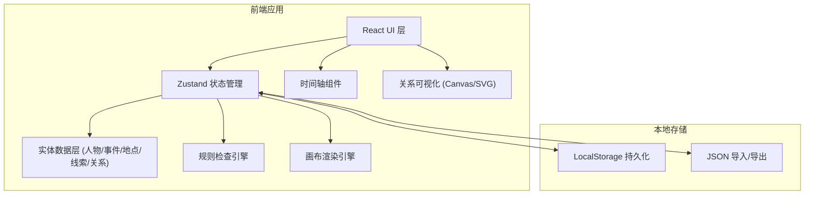
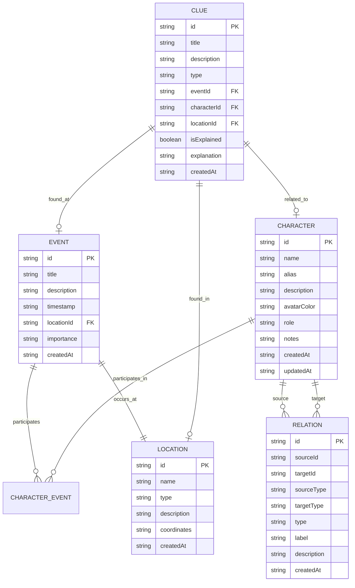

## 1. 架构设计



## 2. 技术选型

- **前端框架**：React@18 + TypeScript
- **构建工具**：Vite@5
- **样式方案**：Tailwind CSS@3
- **状态管理**：Zustand
- **关系图渲染**：原生 SVG + 自定义布局算法（轻量级，避免引入大型图库）
- **图标库**：lucide-react
- **数据持久化**：LocalStorage + JSON 文件导入导出
- **无后端**：纯前端本地应用，所有数据存储在浏览器端

## 3. 路由定义

| 路由 | 用途 |
|------|------|
| `/` | 主侦探板页面，包含所有功能模块 |

单页应用，无需多路由。

## 4. 数据模型

### 4.1 实体关系图



### 4.2 TypeScript 类型定义

```typescript
type EntityType = 'character' | 'event' | 'location' | 'clue';

interface BaseEntity {
  id: string;
  createdAt: string;
  updatedAt: string;
  position?: { x: number; y: number };
}

interface Character extends BaseEntity {
  type: 'character';
  name: string;
  alias?: string;
  role?: string;
  description: string;
  avatarColor: string;
  notes?: string;
}

interface EventEntity extends BaseEntity {
  type: 'event';
  title: string;
  description: string;
  timestamp: string;
  locationId?: string;
  importance: 'low' | 'medium' | 'high' | 'critical';
  participantIds: string[];
}

interface Location extends BaseEntity {
  type: 'location';
  name: string;
  locationType?: string;
  description: string;
}

interface Clue extends BaseEntity {
  type: 'clue';
  title: string;
  description: string;
  clueType: 'physical' | 'testimony' | 'document' | 'digital' | 'other';
  eventId?: string;
  characterId?: string;
  locationId?: string;
  isExplained: boolean;
  explanation?: string;
}

interface Relation {
  id: string;
  sourceId: string;
  sourceType: EntityType;
  targetId: string;
  targetType: EntityType;
  relationType: string;
  label: string;
  description?: string;
  createdAt: string;
}

interface RuleViolation {
  id: string;
  type: 'time_conflict' | 'unexplained_clue' | 'isolated_character';
  severity: 'warning' | 'error' | 'info';
  message: string;
  relatedEntityIds: string[];
  details: string;
}

interface DetectiveBoardState {
  characters: Character[];
  events: EventEntity[];
  locations: Location[];
  clues: Clue[];
  relations: Relation[];
  selectedEntityId: string | null;
  selectedEntityType: EntityType | null;
  timeRangeFilter: { start: string | null; end: string | null };
  violations: RuleViolation[];
  zoom: number;
  pan: { x: number; y: number };
}
```

## 5. 目录结构

```
src/
├── components/
│   ├── board/
│   │   ├── BoardCanvas.tsx       # 关系图画布
│   │   ├── EntityNode.tsx        # 实体节点组件
│   │   ├── RelationEdge.tsx      # 关系连线组件
│   │   └── EntityCreator.tsx     # 新增实体入口
│   ├── sidebar/
│   │   ├── EntityListPanel.tsx   # 实体列表面板
│   │   ├── EntityCard.tsx        # 实体卡片
│   │   └── EntityEditorModal.tsx # 实体编辑弹窗
│   ├── timeline/
│   │   └── TimelineBar.tsx       # 时间轴组件
│   ├── rules/
│   │   ├── RulesPanel.tsx        # 规则检查面板
│   │   └── ViolationItem.tsx     # 违规条目
│   └── common/
│       ├── Toolbar.tsx           # 顶部工具栏
│       └── IconButton.tsx        # 图标按钮组件
├── store/
│   └── useBoardStore.ts          # Zustand 状态管理
├── hooks/
│   ├── useRulesEngine.ts         # 规则检查 Hook
│   ├── useCanvasInteraction.ts   # 画布交互 Hook
│   └── useLocalStorage.ts        # 本地存储 Hook
├── utils/
│   ├── idGenerator.ts            # ID 生成工具
│   ├── layoutAlgorithm.ts        # 节点布局算法
│   └── exportImport.ts           # 导入导出工具
├── types/
│   └── index.ts                  # 类型定义
├── data/
│   └── mockData.ts               # 示例数据
├── pages/
│   └── DetectiveBoard.tsx        # 主页面
├── App.tsx
├── main.tsx
└── index.css
```

## 6. 规则检查引擎设计

### 6.1 时间冲突检测
- 遍历同一人物参与的所有事件
- 检查事件时间是否存在重叠
- 生成冲突报告，包含涉事人物与事件

### 6.2 未解释线索检测
- 查找所有 `isExplained === false` 的线索
- 根据线索存在时长与关联程度计算严重程度

### 6.3 孤立角色检测
- 检查人物是否未参与任何事件
- 检查人物是否未建立任何关系边
- 标记为潜在遗漏角色
