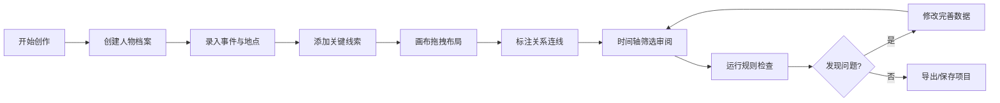

## 1. 产品概述

面向小说创作者、剧本编写者和悬疑故事爱好者的本地化"人物关系侦探板"工具。用户可建立人物档案、记录事件地点、梳理线索脉络、标注人物关系，并通过时间轴和规则检查系统，帮助发现故事漏洞与逻辑冲突。

- 核心价值：为写作者提供可视化的故事结构管理，辅助梳理复杂的人物关系网与时间线
- 目标用户：小说作者、编剧、RPG 游戏主持人、推理爱好者

## 2. 核心功能

### 2.1 用户角色
| 角色 | 注册方式 | 核心权限 |
|------|---------|---------|
| 写作者 | 本地使用无需注册 | 创建/编辑/删除所有数据、关系标注、规则检查、导出 |

### 2.2 功能模块
1. **主侦探板**：可视化关系图画布，支持拖拽节点、连线标注、缩放平移
2. **实体管理侧栏**：人物/事件/地点/线索的创建、编辑、删除与列表浏览
3. **时间轴面板**：按时间顺序展示事件，支持区间筛选与高亮关联实体
4. **规则检查面板**：自动检测时间冲突、未解释线索、孤立角色并给出警示
5. **关系编辑**：创建实体间的关系边，支持类型标注与描述

### 2.3 页面详情
| 页面名称 | 模块名称 | 功能描述 |
|---------|---------|---------|
| 侦探板主页 | 顶部工具栏 | 新建/保存/导入/导出项目、切换视图、缩放控制 |
| 侦探板主页 | 关系图画布 | 节点拖拽、连线交互、缩放平移、节点选中高亮 |
| 侦探板主页 | 左侧实体管理 | 分类 Tab 切换（人物/事件/地点/线索）、卡片列表、新增按钮 |
| 侦探板主页 | 底部时间轴 | 时间刻度、事件节点、滑块区间筛选、点击跳转 |
| 侦探板主页 | 右侧规则检查 | 问题分类列表、问题详情、快速定位跳转 |
| 实体编辑弹窗 | 表单编辑 | 字段输入、关联选择、保存/取消操作 |

## 3. 核心流程

用户打开应用后，从创建人物卡开始，逐步录入事件、地点和线索，然后在画布上拖拽节点并建立关系连线。通过时间轴筛选特定时间段的事件，检查规则面板发现的逻辑问题，不断完善故事脉络。

## 4. 用户界面设计

### 4.1 设计风格
- **主色调**：深棕复古牛皮纸底色 `#2a1f1a`，搭配旧羊皮纸米白 `#f4e8d0` 作为卡片色
- **强调色**：暗红 `#8b2c3e`（警示/重要）、墨绿 `#3a5a40`（线索/正确）、古铜金 `#c9a227`（高亮/选中）
- **按钮风格**：微浮雕圆角，按下有凹陷反馈，边框带细线装饰
- **字体**：标题使用 "Cinzel" 衬线体营造古典侦探氛围，正文使用 "Crimson Text" 优雅衬线体
- **布局**：三栏布局 + 底部时间轴，中央画布为核心区域，侧栏可折叠
- **视觉细节**：卡片添加纸张纹理、图钉装饰、手写字体点缀；画布背景模拟软木板纹理；关系线模拟红绳质感

### 4.2 页面设计概览
| 页面名称 | 模块名称 | UI 元素 |
|---------|---------|---------|
| 侦探板主页 | 顶部工具栏 | 深色木质纹理背景、复古图标按钮、项目名称手写字 |
| 侦探板主页 | 关系图画布 | 软木板背景纹理、实体卡片带阴影与图钉、红绳连线 |
| 侦探板主页 | 左侧实体管理 | 羊皮纸质感卡片列表、分类 Tab 带金属铆钉装饰 |
| 侦探板主页 | 底部时间轴 | 卷轴式时间条、事件节点标记为照片钉、滑块为金属夹子 |
| 侦探板主页 | 右侧规则检查 | 档案夹风格面板、警告图标为放大镜、问题条目带红色下划线 |
| 实体编辑弹窗 | 表单编辑 | 羊皮纸背景、墨水蓝输入框、羽毛笔保存图标 |

### 4.3 响应式设计
- 桌面端优先（1280px+）：三栏完整布局
- 平板端（768-1279px）：侧栏改为抽屉式弹出
- 移动端（<768px）：单列布局，底部时间轴折叠为按钮

### 4.4 动效设计
- 页面加载：实体卡片如照片般从散落堆叠逐步归位
- 节点拖拽：抓取时光标变为手型，卡片轻微上浮
- 规则检查：问题发现时红色放大镜闪烁提示
- 连线创建：从节点拉出红绳，带有弹性动效
- 时间轴筛选：选中区间的事件节点微微发光脉动
